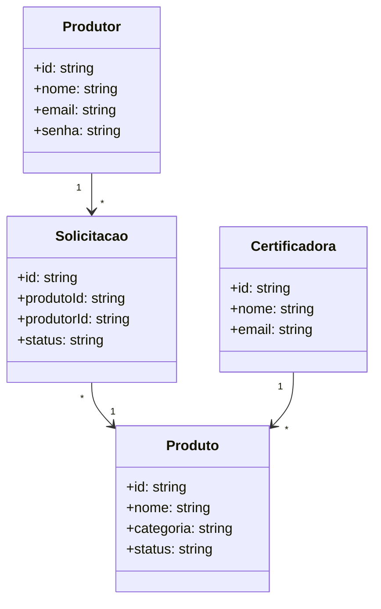
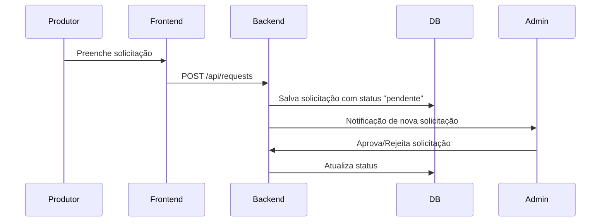
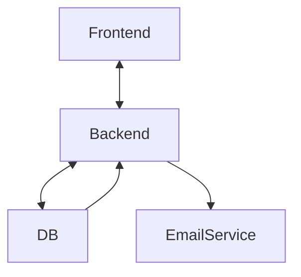

# 📗 Guia Orgânico – Documentação do Projeto

## 1. Organização dos Arquivos – Estrutura em Árvore

```plaintext
guia-organico/
│
├── public/                # Imagens, ícones e arquivos estáticos
├── src/
│   ├── pages/              # Páginas do Next.js (rotas)
│   │   ├── index.tsx       # Página inicial
│   │   ├── admin/          # Painel de administração
│   │   └── api/            # Rotas de API do Next.js
│   │       ├── products.ts # CRUD de produtos
│   │       └── requests.ts # Solicitações de adição
│   ├── components/         # Componentes reutilizáveis
│   ├── styles/             # Estilos (CSS/Tailwind)
│   ├── lib/                # Configurações e conexões (DB, auth)
│   └── hooks/              # Hooks customizados (ex.: useAuth)
│
├── prisma/                 # Schema do banco (se usar Prisma)
├── tests/                  # Testes automatizados
├── docs/                   # Documentação do projeto
│   └── README.md
│
├── package.json
├── tsconfig.json
├── .env.example
└── README.md
```

---

## 2. Engenharia de Software – Normas Técnicas

Este projeto se apoia nas seguintes normas:

- **ISO/IEC 25010** – Modelo de Qualidade de Software (manutenibilidade, usabilidade, eficiência).
- **IEEE 830** – Especificação de Requisitos de Software.
- **ISO/IEC 12207** – Ciclo de vida de software.
- **ISO 9001** – Gestão de qualidade aplicada ao processo de desenvolvimento.

---

## 3. Padrões de Projeto (Design Patterns)

- **MVC (Model-View-Controller)** – Separação clara de responsabilidades.
- **Repository Pattern** – Camada de abstração para acesso ao banco de dados.
- **Observer Pattern** – Atualização em tempo real de solicitações para admin.
- **Singleton** – Configurações centrais do app (ex.: conexão com banco).
- **Factory Method** – Criação padronizada de objetos como `Produto` e `Solicitação`.

---

## 4. Diagramas UML

### 4.1 Diagrama de Casos de Uso

```mermaid
usecaseDiagram
actor Produtor
actor Certificadora
actor Admin

Produtor --> (Buscar insumo)
Produtor --> (Enviar solicitação de autorização)
Certificadora --> (Aprovar/Rejeitar solicitação)
Admin --> (Gerenciar produtos)
Admin --> (Gerenciar usuários)
```

---

### 4.2 Diagrama de Classes



---

### 4.3 Diagrama de Sequência – Fluxo da Solicitação



---

### 4.4 Diagrama de Comunicação – Gerenciamento de Estado



---

## 5. Roadmap de Desenvolvimento – Sprints

**Sprint 1 (Semana 1-2)**  
**Sprint 1 (Semana 1-2) – Checklist Detalhado**

- [x] Inicializar projeto Next.js com TypeScript
- [x] Criar arquivo `package.json` e instalar dependências principais
- [x] Criar arquivo `tsconfig.json` para configuração do TypeScript
- [x] Criar estrutura de pastas:
  - [x] `src/pages` (com `index.tsx`, `admin/`, `api/`)
  - [x] `src/components`
  - [x] `src/styles`
  - [x] `src/lib`
  - [x] `src/hooks`
  - [x] `docs/` (com `GUIA_ORGANICO_DOCUMENTACAO.md`)
- [x] Criar arquivo `.env` com string de conexão do MongoDB Atlas
- [x] Criar cluster no MongoDB Atlas e liberar IP local
- [x] Criar usuário do banco e copiar string de conexão
- [x] Instalar driver do MongoDB (`npm install mongodb`)
- [x] Criar arquivo de conexão com o banco (`src/lib/db.ts`)
- [x] Criar rota de API para listar produtos (`src/pages/api/products.ts`)
- [x] Testar rota `/api/products` para validar conexão
- [x] Remover arquivo `.env.example` para segurança
- [x] Revisar estrutura do projeto conforme documentação

**Próximos passos do Sprint 1:**

- [ ] Criar pasta `public/` para arquivos estáticos
- [ ] Criar pasta `prisma/` se for usar Prisma
- [ ] Criar pasta `tests/` para testes automatizados
- [ ] Implementar CRUD completo de produtos (API e frontend)
- [ ] Documentar endpoints e exemplos de uso

- Painel admin básico

**Sprint 3 (Semana 5-6)**

- Fluxo de solicitações (frontend + backend)
- Envio de notificações por e-mail

**Sprint 4 (Semana 7-8)**

- Upload de imagens (Cloudinary)
- Busca por foto (API de visão computacional)
- Otimizações de performance e SEO

---

## 6. Métricas de Qualidade

- **Tempo de resposta da API**: < 300ms para consultas simples.
- **Cobertura de testes**: 80%+.
- **Uptime**: 99,9% no Vercel.
- **Tempo médio de cadastro**: ≤ 1 minuto para um produto.
- **LCP (Largest Contentful Paint)**: ≤ 2,5s.
