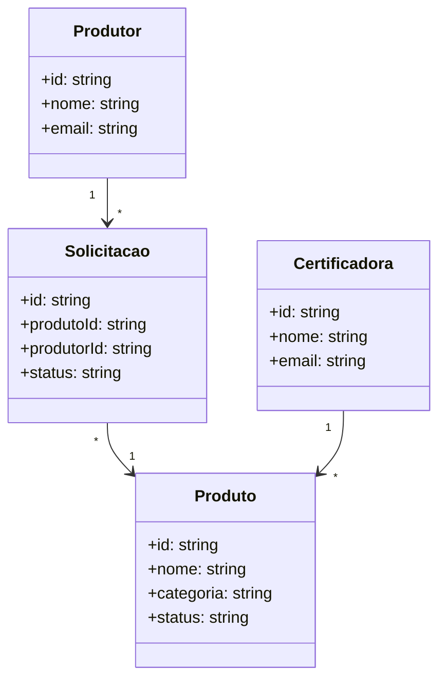
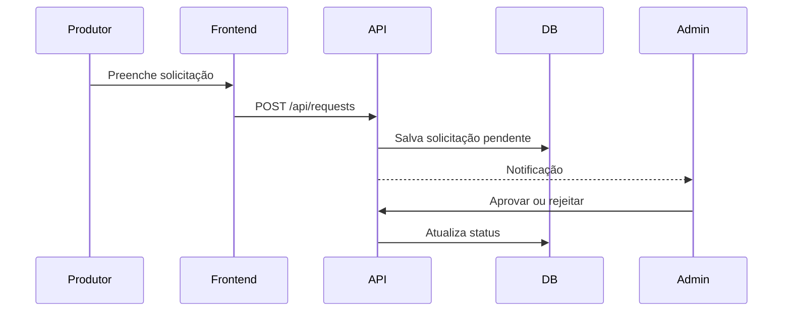

# 📗 Guia Orgânico — Documentação

Documento formal, objetivo e claro. Apresenta a visão final do produto e o status atual do projeto.

## 1. Estrutura de pastas — visão final

```plaintext
guia-organico/
├── docs/
│   └── GUIA_ORGANICO_DOCUMENTACAO.md
├── public/
│   ├── favicon.ico
│   └── images/
├── src/
│   ├── components/
│   │   ├── layout/
│   │   └── ui/
│   ├── hooks/
│   ├── lib/
│   │   ├── db.ts                 # Conexão MongoDB — padrão: Singleton
│   │   ├── repositories/
│   │   │   └── products.repository.ts
│   │   └── services/
│   ├── pages/
│   │   ├── index.tsx             # Página inicial
│   │   ├── admin/
│   │   │   └── index.tsx         # Painel administrativo
│   │   └── api/
│   │       ├── products.ts       # Listagem de produtos — método GET
│   │       └── requests.ts       # Solicitações de autorização — método POST
│   ├── styles/
│   │   ├── globals.css
│   │   └── variables.css
│   ├── types/
│   │   └── product.ts
│   └── utils/
│       └── validations.ts
├── tests/
│   ├── api/
│   └── unit/
├── .env.example
├── .gitignore
├── next-env.d.ts
├── package.json
├── tsconfig.json
└── README.md
```

Nota: alguns arquivos e pastas acima serão criados ao longo do desenvolvimento.

## 2. Checklist do que já foi feito

- Projeto Next.js com TypeScript inicializado.
- Driver `mongodb` instalado e conexão implementada em `src/lib/db.ts` com Singleton.
- Rota de API GET `/api/products` retornando documentos da coleção `products`.
- `.gitignore` adicionado e `.env.example` criado. Arquivo `.env` removido do versionamento.
- Build e checagem de tipos executam com sucesso.

## 3. Convenções e padrões

- Linguagem: TypeScript.
- Framework: Next.js 15, conforme package.json.
- Banco: MongoDB Atlas, variável de ambiente `MONGODB_URI`.
- Estilo de código: padrão Next.js/TS. Linters poderão ser adicionados depois.

Padrões em uso:
- Singleton para reuso da conexão com o MongoDB em `db.ts`.

Padrões planejados:
- Repository para encapsular acesso a dados.
- MVC ou DDD para organização de camadas.
- Observer para notificações e tempo real.
- Factory para criação de entidades.

## 4. Diagramas — visão

Os diagramas a seguir representam a visão pretendida do produto. Servem como referência de arquitetura e requisitos. Serão atualizados quando o escopo evoluir.

### 4.1 Caso de uso

```mermaid
usecaseDiagram
actor Produtor
actor Certificadora
actor Admin

Produtor --> (Buscar insumo)
Produtor --> (Enviar solicitação de autorização)
Certificadora --> (Aprovar/Rejeitar solicitação)
Admin --> (Gerenciar produtos)
Admin --> (Gerenciar usuários)
```

### 4.2 Classes



### 4.3 Sequência



## 5. Roadmap

Concluído:
- Projeto base Next.js com TypeScript.
- Conexão com MongoDB e GET `/api/products`.

Pendências imediatas:
- Definir nome do banco explicitamente em `client.db("<nome>")`.
- Criar `public/` e `components/` conforme a UI evoluir.
- Definir modelos e validação para `products` e iniciar CRUD completo.

Futuro:
- Fluxo de solicitações e notificações por email.
- Painel administrativo.
- Testes automatizados e métricas.

## 6. Métricas planejadas

- Tempo de resposta da API em GET simples: até 300 ms.
- LCP da página inicial: até 2,5 s.
- Cobertura de testes: a partir de 80 por cento após introdução de testes.
- Uptime em produção: a partir de 99,9 por cento.

## 7. Variáveis de ambiente

Criar um arquivo `.env` local com:

```
MONGODB_URI="mongodb+srv://<usuario>:<senha>@<cluster>/?retryWrites=true&w=majority"
```

Não versionar `.env`. Usar o `.env.example` como referência.

## 8. Normas e referências

- ISO/IEC 25010 — Qualidade de produto de software.
- IEEE 830 — Especificação de requisitos de software.
- ISO/IEC 12207 — Processos do ciclo de vida de software.

Nota: são referências para orientar o processo. O escopo atual ainda não implementa todas as práticas.

## 9. Padrões de projeto

- Em uso: Singleton para conexão MongoDB em `db.ts`.
- Planejados: Repository, MVC ou DDD, Observer, Factory.
